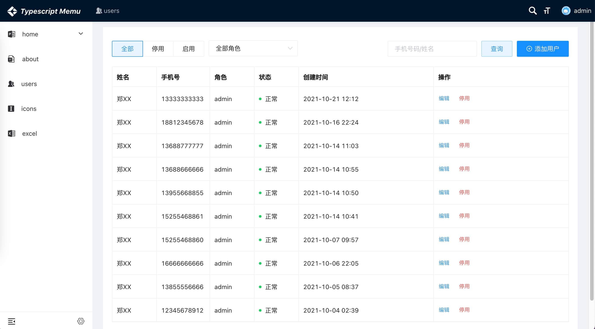
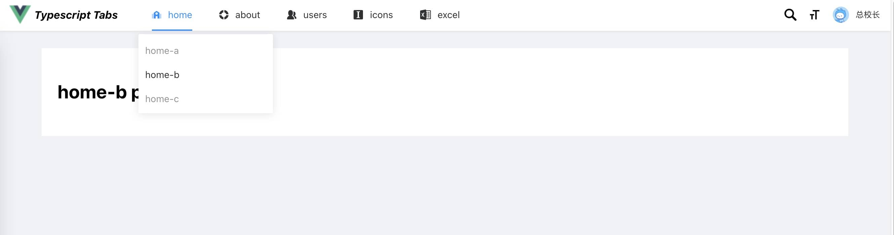

# Vue Typescript Toolkit

Provides built-in TypeScript tooling support,The Vue Typescript command line interface (CLI) is your go-to tool for developing [vue2-typescript][vue2-typescript] apps.

    vtx create - Create vue project template with typescript 
    vtx generate - Create Pages, Components,Services,Modals & vue Features

Automatically create framework features with vtx Generate. This command uses the commander CLI to generate features such as pages, components, directives, services, modals and more.

You can specify a path to nest your feature within any number of subdirectories. For example, specify a name of "pages/New Page" to generate page files at src/app/pages/new-page/.


### Installation

```
npm install -g vue-ts-toolkit
```

### Usage:
    $ vtx create <project-name>

    $ vtx generate <type> <name>

### Inputs:

    type ................. The type of feature (e.g. page, component, directive, service)
    name ................. The name/path of the feature being generated


### Examples:
    $ vtx -h 
    $ vtx g -h 
    $ vtx create myApp 
    $ vtx create myApp sidemenu|tabs|mix
    $ vtx generate page about
    $ vtx generate page contact --router=root|layout
    $ vtx generate page pages/home/home-a --router=layout
    $ vtx generate component contact/form
    $ vtx generate directive ripple --export
    $ vtx generate directive ripple -e
    $ vtx generate service user
    $ vtx generate modal user
    $ vtx generate store user
    $ vtx generate/g interface user
    $ vtx generate/g class user

## template type

<table>
    <thead>
        <th>
            sidemenu
        </th>
        <th>
            tabs
        </th>
        <th>
            mix
        </th>
    </thead>
    <tr>
        <td>
            
        </td>
        <td>
            
        </td>
        <td>
            
        </td>
    </tr>
</table>

## Module Structure

```bash
├── class                               # class files
│   │── classa.ts                       # class a with typescript
│   └── classb.ts                       # class b with typescript
│
├── pages                               # pages
│   ├── page1                           # page1
│   └── page2                           # page2
│        │── page2.page.html            # page2 tempate
│        │── page2.page.ts              # page2 logic code 
│        │── page2.page.scss            # page2 style 
│        │── page2.page.vue             # page2 vue file for module declare  
│        └── page2.routing.ts           # page2 routing file for export
│
│
├── components                           # global components
│   ├── component1                       # page1
│   └── component2                       # page2
│   │     │── component2.component.html  # component2.componentate
│   │     │── component2.component.ts    # component2.componentc code 
│   │     │── component2.component.scss  # component2.componente 
│   │     └── component2.component.vue   # component2.componentfile for module declare   
│   │       
│   └── index.ts                         # module export whit components 
│
│
├── modals                               # global overlay modals
│   ├── modal                            # modal controller
│   └── modal2                           # page2
│   │     │── modal2.modal.html          # modal2
│   │     │── modal2.modal.ts            # modal2 logic code 
│   │     │── modal2.modal.scss          # modal2 style 
│   │     └── modal2.modal.vue           # modal2 file for module declare   
│   │       
│   └── index.ts                         # module export whit modals                      
│
│
├── directives                     # global directives
│   ├── directive1.ts              # directive1
│   ├── directive2.ts              # directive2    
│   └── index.ts                   # module export whit directives 
│
│── http                           # http request axios
│   ├── http.ts                    # axios 
│   └── index.ts                   # request as get,post,download,put,delete          
│
│
│── services                       # api
│         
│── layout                         # global layout
│
│── store                          # store 
│
│── router                         # router 
│
│── icons                         # router          
```

---

[vue2-typescript]: https://cn.vuejs.org/v2/guide/typescript.html